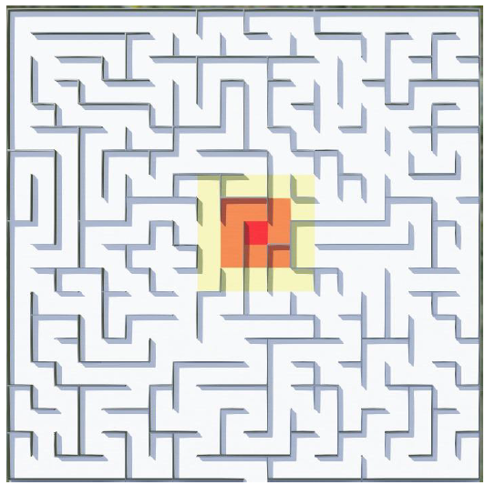

# 🔥 RoboGames 2024 - University Category (Elimination Round Task)

Welcome to the official repository for our submission to the **IESL RoboGames 2024 - University Category (Elimination Round)**. This task involved simulating a robot in a burning maze environment using **Webots**, with the objective of rescuing survivors and avoiding fire pits.

 <!-- Replace with your actual image path -->

---

## 🧠 Problem Statement

The Faculty of Robo Games is on fire! Your mission is to program a robot to:

- 🔍 Perform a dry run of the maze (fire zones + survivors)
- 🧑‍🚒 Rescue 3 survivors placed randomly in the maze
- ⛑️ Stay within the survivor square for 3 seconds to rescue
- 🚪 Return to the starting point to complete the mission
- 🧯 Avoid fire pits (Red, Orange, Yellow zones) to preserve score

---

## 🛠️ Arena Specifications

- **Maze Size:** 5m × 5m  
- **Cell Size:** 0.25m × 0.25m  
- **Fire Pits:**  
  - 🔴 Red Zone: 40 damage  
  - 🟠 Orange Zone: 10 damage  
  - 🟡 Yellow Zone: 0 damage  
- **Survivor:** Green cube (`#55FF00`) worth 20 points each

---

## 🤖 Robot Specifications

- Built from scratch in Webots (similar to the e-puck)
- Max Size: 25cm x 25cm x 25cm
- No camera vision beyond wall limits
- Custom logic for rescue + path planning

---

## 🧪 Evaluation Criteria

- ✅ +100 base score if at least one survivor rescued  
- ➕ +20 per survivor rescued  
- ⏱️ Tiebreaker: Completion time  
- 📜 Code review for identical scores & times  
- ❌ Disqualification: Score ≤ 0 or rule violations  

---

## 📂 Project Structure

-├── controllers/
-│ └── rescue_controller.py
-├── worlds/
-│ └── maze_world.wbt
-├── images/
-│ └── demo.png
-├── README.md
-└── requirements.txt
